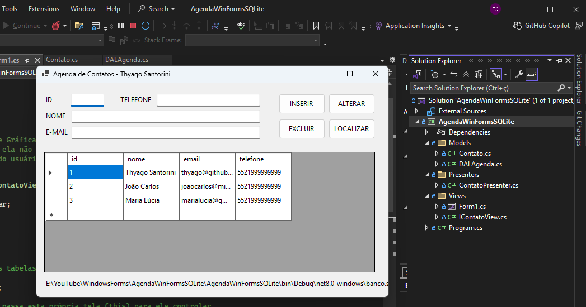

### 📖 Agenda de Contatos - C# Windows Forms

Um aplicativo de gerenciamento de contatos desenvolvido em **C#** utilizando **Windows Forms** e banco de dados **SQLite**. Este projeto foi construído com foco em boas práticas de programação e utiliza a arquitetura **MVP (Model-View-Presenter)** para garantir um código limpo, modular e de fácil manutenção.

---

#### ✨ Funcionalidades

- **Inserir:** Cadastro de novos contatos contendo Nome, E-mail e Telefone.
- **Alterar:** Atualização de dados de contatos existentes.
- **Excluir:** Remoção de contatos do banco de dados de forma segura.
- **Localizar:** Busca inteligente (por ID exato ou por parte do Nome).
- **Banco de Dados Automático:** O sistema verifica a existência do banco de dados na inicialização e o recria automaticamente (junto com as tabelas) caso não exista.

---

#### 🛠️ Tecnologias Utilizadas

- **Linguagem:** C# (.NET 8)
- **Interface:** Windows Forms
- **Banco de Dados:** SQLite (`System.Data.SQLite`)
- **Arquitetura:** MVP (Model-View-Presenter)
- **IDE:** Visual Studio 2022

---

#### 🏗️ Arquitetura (Padrão MVP)

O projeto foi refatorado para abandonar o padrão "Smart UI" (código acoplado na interface) e agora divide responsabilidades claramente em três camadas:

*   📂 **Models:** Contém as entidades (`Contato.cs`) e a camada de acesso a dados/DAL (`DALAgenda.cs`), responsável por toda a comunicação com o SQLite via queries parametrizadas (evitando SQL Injection).
*   📂 **Views:** Contém a interface gráfica (`Form1.cs`) que é completamente "passiva". Ela herda o contrato `IContatoView.cs`, repassando interações do usuário para o Presenter e exibindo o que ele manda.
*   📂 **Presenters:** Contém o cérebro da aplicação (`ContatoPresenter.cs`). É aqui que residem os blocos `try/catch`, a lógica de negócio e o controle do fluxo de dados entre a View e o Model.

---

#### 🚀 Como executar o projeto

1. Faça o clone deste repositório:
   ```bash
   git clone [https://github.com/seu-usuario/AgendaWinFormsSQLite.git](https://github.com/thyagosantorini/AgendaWinFormsSQLite.git)
2.Abra o arquivo AgendaWinFormsSQLite.sln no Visual Studio.

3.Se necessário, o Visual Studio irá restaurar o pacote NuGet do SQLite automaticamente.

4.Pressione F5 ou clique em Iniciar (Start).

5.Nota: O banco de dados banco.sqlite será criado automaticamente na pasta bin/Debug ao executar o programa pela primeira vez.


